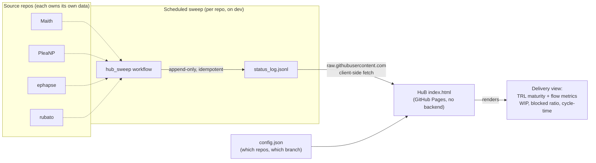

# HuB — Repo Status

A read-only, static dashboard that aggregates each tracked repo's
`status_log.jsonl` and renders TRL maturity and Kanban flow metrics per repo.
Two files (`index.html`, `config.json`) served by GitHub Pages. No build step,
no backend, no database.

This is a **mirror**: it only fetches and displays. Source repos own their own
`status_log.jsonl` and write it themselves. See
[`HUB_AGENT_HANDOFF.md`](HUB_AGENT_HANDOFF.md) for the architecture and its
rationale, and [`PM_STATUS_FRAMEWORK.md`](PM_STATUS_FRAMEWORK.md) for the record
schema every source repo must match.

## How it works



Each source repo runs the same `hub_sweep` workflow on a schedule. It appends one
line to that repo's own `status_log.jsonl` (no change on a no-op run, so the log
is append-only and never double-counts). HuB then reads every log directly from
`raw.githubusercontent.com` in the browser — no server, no aggregation step. A
repo becomes visible by adding one entry to `config.json`.

## Tracked repos

`config.json` currently tracks four public repos, all on `dev`:

| Repo | Owner / repo | Branch |
|---|---|---|
| Maith | `philipdallen/Maith` | `dev` |
| PleaNP | `philipdallen/PleaNP` | `dev` |
| Ephapse | `philipdallen/ephapse` | `dev` |
| Rubato | `philipdallen/rubato` | `dev` |

Adding a repo is one addition to the `repos` array. Note that
`raw.githubusercontent.com` only serves **public** repos to an unauthenticated
client-side fetch, so a private repo cannot be added.

### Why `dev` and not the default branch

This is a deliberate choice, not an accident of setup. Each source repo writes
`status_log.jsonl` on `dev`, because the sweep workflow runs there — the active
development branches are where delivery activity actually happens, and `dev` is
the system of record per each repo's branch protocol. `status_log.jsonl` does
**not** exist on the default branches (`main`) in any of the four repos, so
pointing `config.json` at `main` would make every tab read amber.

The trade-off is accepted explicitly: `dev` is fresher but churnier, so a tab
can briefly show a fetch error if a branch is mid-rewrite. If a source repo ever
adopts `main` as its system of record, the fix is to change that repo's `branch`
field in `config.json` and add the `status_log.jsonl` write to the same branch.

## Deployment

1. Repo settings → Pages → Deploy from a branch → `main`, `/ (root)`.
2. No build step. `index.html` and `config.json` live at the repo root.
3. Open the page and confirm each tab's dot resolves from grey (loading) to a
   colour: teal = data found, amber = no `status_log.jsonl` yet (expected today),
   rose = fetch error (repo private, branch typo, network). Amber and rose are
   bugs, not states to accept — all four tabs read **teal** today.

## Validation

`config.json` is the one file whose corruption is invisible: a typo in an owner,
repo, or branch field degrades a tab to amber without failing anything. CI closes
that hole.

```bash
python3 tools/validate_config.py
```

`tools/validate_config.py` parses `config.json`, then fetches each tracked
repo's `status_log.jsonl` and asserts it exists, is non-empty, and ends in valid
JSON. It exits non-zero if any tracked repo does not resolve, so the failure
surfaces in CI rather than in a browser tab. The `CI` workflow runs it on every
push and pull request.

## Current state

All four source repos have the sweep extension (`tooling/hub_sweep.py`, or
`tools/hub_sweep.py` in rubato) and the scheduled `hub_sweep` workflow installed
on their `dev` and default branches. All four dashboard tabs render **teal
(ok)** with real data. The workflow is idempotent: on a run with no change it
appends nothing.