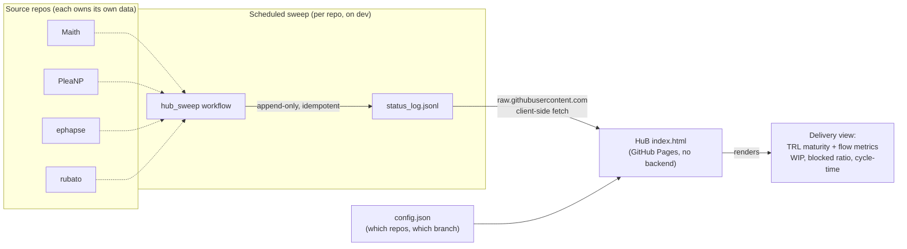

# HuB — Repo Status

A read-only, static dashboard that aggregates each tracked repo's
`status_log.jsonl` and renders TRL maturity and Kanban flow metrics per repo.
Two files (`index.html`, `config.json`) served by GitHub Pages. No build step,
no backend, no database.

This is a **mirror**: it only fetches and displays. Source repos own their own
`status_log.jsonl` and write it themselves. See
[`HUB_AGENT_HANDOFF.md`](HUB_AGENT_HANDOFF.md) for the architecture and its
rationale, and [`PM_STATUS_FRAMEWORK.md`](PM_STATUS_FRAMEWORK.md) for the record
schema every source repo must match.

## How it works



Each source repo runs the same `hub_sweep` workflow on a schedule. It appends one
line to that repo's own `status_log.jsonl` (no change on a no-op run, so the log
is append-only and never double-counts). HuB then reads every log directly from
`raw.githubusercontent.com` in the browser — no server, no aggregation step. A
repo becomes visible by adding one entry to `config.json`.

## Tracked repos

`config.json` currently tracks four public source repos plus this repo's own
automation log:

| Repo | Owner / repo | Branch | Publishes |
|---|---|---|---|
| Maith | `philipdallen/Maith` | `status` | `flow`, `trl` |
| PleaNP | `philipdallen/PleaNP` | `main` | `flow`, `trl` |
| Ephapse | `philipdallen/ephapse` | `main` | `flow`, `trl` |
| Rubato | `philipdallen/rubato` | `main` | `flow`, `trl` |
| Automation | `philipdallen/HuB` | `main` | `automation` |

Adding a repo is one addition to the `repos` array. Note that
`raw.githubusercontent.com` only serves **public** repos to an unauthenticated
client-side fetch, so a private repo cannot be added.

### Branches

The `branch` field is the branch each source repo's sweep workflow writes to,
which is the branch its log actually lives on — not necessarily the repo's
default. Read the live value from `config.json`; the table above is a snapshot
and `config.json` wins. Pointing an entry at a branch with no
`status_log.jsonl` makes that tab read amber, which `tools/validate_config.py`
catches in CI.

## The Automation tab

The other four tabs report on a repo's *delivery* state (`flow`, `trl`). The
Automation tab reports on the *automation itself*, from a different block in the
same log format, and is written by this repo rather than a source repo:

```json
{"timestamp":"...","automation":{"runs_24h":29,"runs_7d":96,"claims_total":1,
 "stale_claims":["ephapse #39"],"stale_claims_total":1,"last_run":"..."},
 "notes":"..."}
```

`automation_sweep.py` derives it from public data on a schedule:

- **Run activity** — run-ids appear verbatim in agent comments as
  `run=YYYYMMDD-HHMM-xxxx`. A run-id encodes its own UTC start time, so no extra
  call is needed to date it. The same id seen in two repos counts once.
- **Real WIP** — `claims/N.claim` files, which are the actual lock. The
  published `flow.wip` counts the `status:claimed` *label*, which is a different
  number and can read 0 while work is in flight.
- **Stale claims** — a claim file whose issue is already CLOSED. Nothing
  releases the lock on close, so these accumulate and mislead any claim-counting
  reader.

**Deliberately absent: failure rate and idle rate.** A failed run dies before it
comments, so it leaves no public trace — only runs that reached the point of
commenting are visible. Those two numbers need the automation API and a
credential, which a static public page cannot hold. An absent field renders as
an em dash, never as 0.

### Why this repo writes its own log

`index.html` is static: no backend, no credentials, and it can only fetch over
the public CDN. It cannot call the GitHub API — the unauthenticated budget is 60
requests/hour *per visitor IP*, and a single page load that fetched comments
would spend about a third of it, breaking the page for everyone behind a shared
address. So the numbers must be precomputed by a scheduled job, which is
`automation_sweep.yml`. It runs with `contents: write` and writes exactly one
file, in this repo. The page stays read-only to visitors.

## Deployment

1. Repo settings → Pages → Deploy from a branch → `main`, `/ (root)`.
2. No build step. `index.html` and `config.json` live at the repo root.
3. Open the page and confirm each tab's dot resolves from grey (loading) to a
   colour: teal = data found, amber = no `status_log.jsonl` yet (expected today),
   rose = fetch error (repo private, branch typo, network). Amber and rose are
   bugs, not states to accept.

## Validation

`config.json` is the one file whose corruption is invisible: a typo in an owner,
repo, or branch field degrades a tab to amber without failing anything. CI closes
that hole.

```bash
python3 tools/validate_config.py
```

`tools/validate_config.py` parses `config.json`, then fetches each tracked
repo's `status_log.jsonl` and asserts it exists, is non-empty, and ends in valid
JSON. It exits non-zero if any tracked repo does not resolve, so the failure
surfaces in CI rather than in a browser tab. The `CI` workflow runs it on every
push and pull request.

## Current state

All four source repos have the sweep extension (`tooling/hub_sweep.py`, or
`tools/hub_sweep.py` in rubato) and the scheduled `hub_sweep` workflow installed.
The workflow is idempotent: on a run with no change it appends nothing.

The Automation tab is written by this repo's own `automation_sweep.yml` and
`automation_sweep.py`. Both sweeps run a selftest in CI
(`automation_sweep.py --selftest`), because a check that cannot be shown to fail
is not a check.